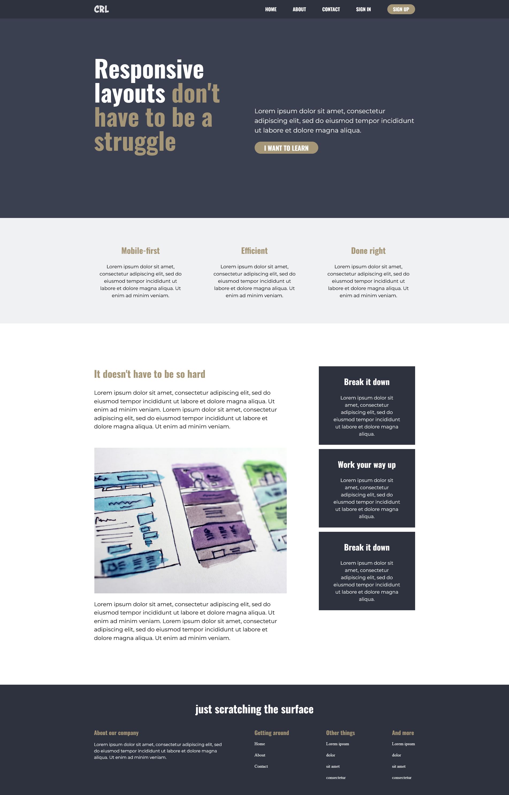
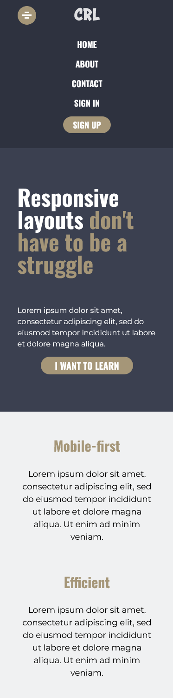

# Kevin Powell - Conquering Responsive Layouts - Final Challenge

This is my solution to the [Final Conquering Responsive Layouts Challenge](https://courses.kevinpowell.co/conquering-responsive-layouts).

## Table of contents

- [Overview](#overview)
  - [The challenge](#the-challenge)
  - [Screenshot](#screenshot)
  - [Links](#links)
- [My process](#my-process)
  - [Built with](#built-with)
  - [What I learned](#what-i-learned)
  - [Continued development](#continued-development)
  - [Useful resources](#useful-resources)
- [Author](#author)

## Overview

### The challenge

Users should be able to:

- Create a responsive website with the given design
- Set breakpoints for 1000 pixels and 700 pixels.

### Screenshot





### Links

- Solution URL: [https://github.com/CaptainKaveman/KevinPowellCRL-Final]
- Live Site URL: [https://captainkaveman.github.io/KevinPowellCRL-Final/]

## My process

This in my first project in a while that I did not start with mobile first. I learned that I prefer to start with the mobile design, because I find it a little easier to create the media querys. I wish that I had worked on my small and medium screen size first for the navigation bar. I had to redo a few things since I was adding in the hamburger button to display my nav menu. With this challenge I also wanted to practice creating a site using SASS. This is my first project using SCSS to create my styles.

### Built with

- Semantic HTML5 markup
- SASS/SCSS
- Vanilla JavaScript

### What I learned

This was my first project that I used SCSS to create the styles and I learned a lot. I used the two mixins below to quickly adjust the styles for various sections. I really enjoyed working with SASS and look forward to leaning more features.

```scss
@mixin container($width: 90%, $max-width: 75em) {
  margin: 0 auto;
  width: $width;
  max-width: $max-width;
  position: relative;
}

@mixin row($display: flex, $justify: space-between, $flex-dir: row) {
  display: $display;
  justify-content: $justify;
  flex-direction: $flex-dir;
}
```

### Continued development

For the continuation of this project I would like to create other pages that the navigation can link to. I want to practice UI and UX design and then code that into a working site. Similarly to this project and those that I have completed from Frontendmento.io.

### Useful resources

- [Kevin Powell](https://www.youtube.com/kepowob) - Tons of resources and really helped me to understand CSS. His videos also helped me learn a little bit about SASS and I look forward to taking the beyondCSS course to further my knowledge.
- [Mozilla Web Docs](https://developer.mozilla.org/en-US/docs/Web) - This helped me look up different styling options, and learn how some of them work.
- [W3schools](w3schools.com) - This is another great source for information on various programming languages.

## Author

- Website - [Kyle Corwin](https://www.kylecor.win)
- GitHub - [@CaptainKaveman](https://github.com/CaptainKaveman)
- Twitter - [@TheKyleCorwin](https://www.twitter.com/TheKyleCorwin)
