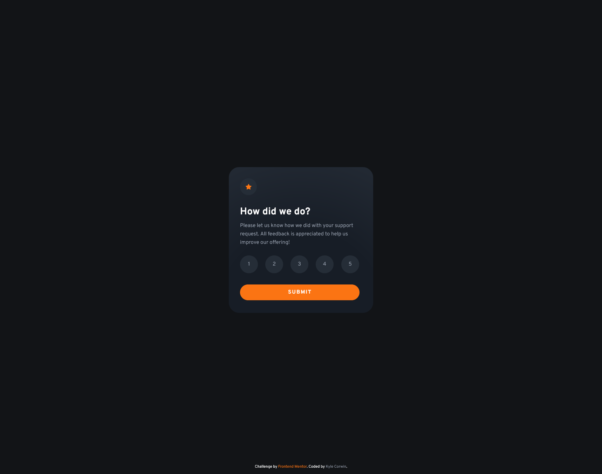
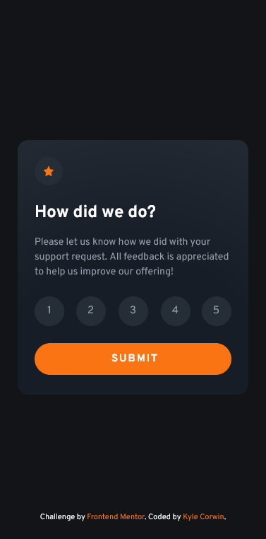

# Frontend Mentor - Interactive rating component solution

This is a solution to the [Interactive rating component challenge on Frontend Mentor](https://www.frontendmentor.io/challenges/interactive-rating-component-koxpeBUmI). Frontend Mentor challenges help you improve your coding skills by building realistic projects.

## Table of contents

- [Overview](#overview)
  - [The challenge](#the-challenge)
  - [Screenshot](#screenshot)
  - [Links](#links)
- [My process](#my-process)
  - [Built with](#built-with)
  - [What I learned](#what-i-learned)
  - [Continued development](#continued-development)
  - [Useful resources](#useful-resources)
- [Author](#author)

## Overview

### The challenge

Users should be able to:

- View the optimal layout for the app depending on their device's screen size
- See hover states for all interactive elements on the page
- Select and submit a number rating
- See the "Thank you" card state after submitting a rating

### Screenshot




### Links

- Solution URL: [https://github.com/CaptainKaveman/Interactive-rating]
- Live Site URL: [https://captainkaveman.github.io/Interactive-rating]

## My process

I prefer to start with the mobile design and then add my media query to add responsiveness. I started with adding all of the HTML that would be needed for the site. After the HTML was done I added the custom classes that I would need. I then linked to my style sheet and added my CSS stylings. I started with creating the card and then worked from the top down to get my styling done. I used radio buttons to create the number options of 1 to 5. After the first card was done I added a custom class called .hidden to hide the card and then created the thank you card. I used a custom class called .card that is shared between the two cards to set the size of them.

After the CSS was styled I worked on creating my function to identify what radio button was selected and to change the span tag to that value. Also in that function it will remove the hidden class from the thank you card (.card2) and then add the hidden class to the selection card (.card1). This function was added to the HTML submit button using onclick. I also created another function to reset the previous selection of the radio button if the page is refreshed. This was added to the body element using onload.

### Built with

- Semantic HTML5 markup
- CSS custom properties
- Mobile-first workflow
- Vanilla JavaScript

### What I learned

This was my first project that uses JavaScript to interact with elements on a webpage. I learned a lot about how to have JavaScript code look for elements and attributes and manipulate it.

```html
<div class="submit">
	<button type="submit" onclick="results();">Submit</button>
</div>
```

```css
.hidden {
	display: none;
}
```

```js
function results() {
	const radio = document.getElementsByName("rating");
	const span = document.querySelector("span");
	const remove = document.getElementById("card2").classList.remove("hidden");
	const add = document.getElementById("card1").classList.add("hidden");
	for (let i = 0; i <= radio.length; i++) {
		if (radio[i].checked === true) {
			span.textContent = i + 1;
			return remove, add;
		}
	}
}
```

### Continued development

For the continuation of this project I want to use SASS for the CSS styling and look at using some JavaScript packages like JQuery. I also haven't been able to add a check for the submit button on click to make sure that a radio button has been selected before it changes to the thank you card. Adding an else statement with an alert would still cause the thank you card to be displayed and the alert would always show.

### Useful resources

- [Mozilla Web Docs](https://developer.mozilla.org/en-US/docs/Web) - This helped me look up the vanilla JavaScript to understand how to use the different methods.
- [Kevin Powell](https://www.youtube.com/kepowob) - His videos are amazing and have really helped to understand a lot about CSS. He is also the reason I started with mobile first, which I felt was a lot easier.

## Author

- Website - [Kyle Corwin](https://www.kylecor.win)
- Frontend Mentor - [@CaptainKaveman](https://www.frontendmentor.io/profile/CaptainKaveman)
- Twitter - [@TheKyleCorwin](https://www.twitter.com/TheKyleCorwin)
