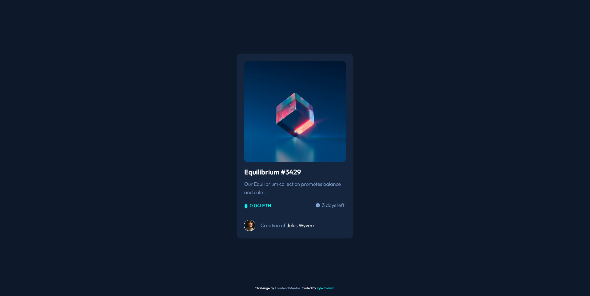

# Frontend Mentor - NFT preview card component solution

This is a solution to the [NFT preview card component challenge on Frontend Mentor](https://www.frontendmentor.io/challenges/nft-preview-card-component-SbdUL_w0U). Frontend Mentor challenges help you improve your coding skills by building realistic projects. 

## Table of contents

- [Overview](#overview)
  - [The challenge](#the-challenge)
  - [Screenshot](#screenshot)
  - [Links](#links)
- [My process](#my-process)
  - [Built with](#built-with)
  - [What I learned](#what-i-learned)
  - [Continued development](#continued-development)
  - [Useful resources](#useful-resources)
- [Author](#author)

## Overview

### The challenge

Users should be able to:

- View the optimal layout depending on their device's screen size
- See hover states for interactive elements

### Screenshot

 


### Links

- Solution URL: [https://github.com/CaptainKaveman/nftPreviewCard]
- Live Site URL: [https://www.kylecor.win/projects/nftPreviewCard]

## My process

I started with adding all of the content in HTML, then I thought about what classes I needed. After the HTML and custom classes were done I begain to style it linking to an external CSS file. After creating the file I created custom variables in the root for all of the font weights and colors, this makes it easy to change any of these in the future. I found it easier to start with the mobile design since there wasn't a lot of changes that needed to be made for larger screen sizes. I created the card and centered it on the page using Display: Flex. I started at with the image of the card and then styled the content as I worked down the card. After all the content in the card was styled I addes some spacing variables in the root so that I could adjust line-height and spacing in my classes. 

After the mobile design was completed I added in two media queries to create responsiveness for various screens. The first media query which was required for the challenge adjusts the card size for screens that are over 60em. The second media query wasn't required, but adds some responsiveness for screens that are that are between 40em and 59em, like iPads. After the responsiveness was completed I added in the hover effects for the three required links. The one I found most challenging was the image hover. I was able to do it by creating a class called Overlay and that had the background color variable I created using hsla to give it a opacity, and the view icon which was centered. I then set the opacity to 0 on the overlay which made it hidden, then I put the container class with a hover to change the opacity of my overlay class to a 1.

### Built with

- Semantic HTML5 markup
- CSS custom properties
- Root variables
- Mobile-first workflow

### What I learned

The most challenging part for me on this project was getting the view icon with a cyan background as a hover effect for the image. I was finally able to get it using the following code bellow. The first class sets the container size for my image. The next class creates my overlay which is the view image ontop of the cyan background. I created a variable in the root using an hsla for the cyan color provided by Frontend Mentor, the a(alpha) was then set to 0.5 to give the color some opacity. I set this class with an opacity of 0 so that it is hidden. I finally added a hover to the container class pointing to the overlay class to change the opacity to 1.

```css
.card-pic-container {
	height: 330px;
	width: 100%;
}

.overlay {
	height: 100%;
	width: 100%;
	border-radius: 10px;
	background-color: var(--primary-clr-cyan-hover);
	background-image: url(/images/icon-view.svg);
	background-repeat: no-repeat;
	background-position: center;
	cursor: pointer;
	opacity: 0;
	transition: 0.5s ease;
}

.card-pic-container:hover .overlay {
	opacity: 1;
}
```

I had tried adding an inset box-shadow for the hover effect, but it also shadowed the view icon. Might be worth some more research to see if it is possible to use this method as well. The code I used in the class for the box-shadow is below.

```css
box-shadow: inset 0 0 0 100vmax var(--primary-clr-cyan-hover);
```

### Continued development

In the future I would like to explore some better ways of styling the content. I used the inspect tool a few times and found that some of my CSS styling didn't actually change anything. Other areas to improve on are adding in more comments and better orgainizing the style sheet. Right now it is mainly organized by:

Root > HTML Elements > Custom Classes (Top to bottom) > Footer > Media Queries 

### Useful resources

- [W3 Schools](https://www.w3schools.com) - This helped me understand some of the CSS styling. It was a big help on solving my overlay problem for the image hover.
- [Kevin Powell](https://www.youtube.com/kepowob) - His videos are amazing and have really helped to understand a lot about CSS. He is also the reason I started with mobile first, which I felt was a lot easier.

## Author

- Website - [Kyle Corwin](https://www.kylecor.win)
- Frontend Mentor - [@CaptainKaveman](https://www.frontendmentor.io/profile/CaptainKaveman)
- Twitter - [@TheKyleCorwin](https://www.twitter.com/TheKyleCorwin)
