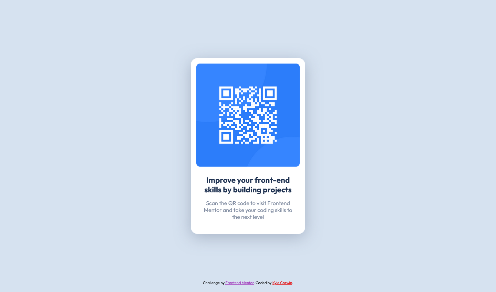

# Frontend Mentor - QR code component solution

This is a solution to the [QR code component challenge on Frontend Mentor](https://www.frontendmentor.io/challenges/qr-code-component-iux_sIO_H). Frontend Mentor challenges help you improve your coding skills by building realistic projects.

## Table of contents

- [Overview](#overview)
  - [Screenshot](#screenshot)
  - [Links](#links)
- [My process](#my-process)
  - [Built with](#built-with)
- [Author](#author)

## Overview

### Screenshot

### Links

- Solution URL: [https://github.com/CaptainKaveman/qr-code-component]
- Live Site URL: [https://captainkaveman.github.io/qr-code-component/]

## My process

### Built with

- Mobile-first workflow
- Sass/Scss
- Flexbox
- Semantic HTML5 markup

## Author

- Website - [Kyle Corwin](https://www.kylecor.win)
- Frontend Mentor - [@CaptainKaveman](https://www.frontendmentor.io/profile/CaptainKaveman)
- Twitter - [@TheKyleCorwin](https://twitter.com/TheKyleCorwin)
